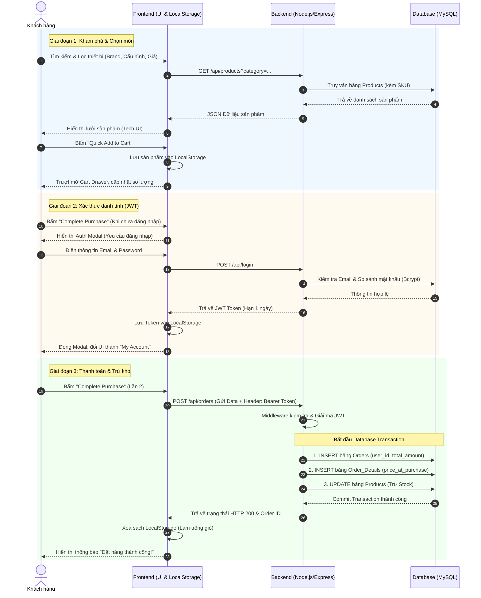

# PHÂN TÍCH YÊU CẦU (Tech E-Commerce)

### 1. Mục tiêu và phạm vi dự án 
- Mục tiêu: Xây dựng một nền tảng thương mại điện tử chuyên phân phối thiết bị công nghệ (Điện thoại, Laptop, Phụ kiện), lấy cảm hứng UX/UI từ Best Buy. Giao diện sử dụng Tiếng Anh toàn cầu, tông màu xanh dương/vàng đặc trưng, mang lại trải nghiệm mua sắm hiện đại và đáng tin cậy.
- Phạm vi dự án:
    - Quản lý luồng mua hàng đồ công nghệ (Cart Drawer -> Checkout -> Order Tracking).
    - Phân loại sản phẩm công nghệ theo danh mục sâu (Category tree) và quản lý thông số đặc thù (SKU, Brand).
    - Hệ thống xác thực bảo mật cao (JWT) phục vụ các giao dịch giá trị lớn.

## 2. Phân tích yêu cầu chức năng
### 2.1. Nhóm Khách hàng (Customer & Guest)

| Nhóm chức năng | Chi tiết chức năng | Yêu cầu đầu ra |
| :--- | :--- | :--- |
| **Quản lý Tài khoản** | Đăng ký & Đăng nhập | Quản lý thông tin qua JWT. Tự động hiển thị "My Account" khi đã đăng nhập thành công. |
| **Khám phá đồ Công nghệ** | Xem, tìm kiếm, filter, sort | Hiển thị sản phẩm theo danh mục (Computers, Cell Phones, Audio).   Lọc theo cấu hình, giá bán, thương hiệu (brand).   Xem hình ảnh thiết kế chi tiết. |
| **Giỏ hàng (Cart Drawer)** | Thêm/ Sửa/ Xóa | Giao diện trượt (Drawer) từ cạnh phải màn hình.   Lưu trữ dữ liệu bằng LocalStorage chống mất mát khi F5. |
| **Thanh toán** | Xử lý đơn hàng | Gửi gói JSON chứa thông tin giao hàng và JWT xuống máy chủ để ghi nhận đơn |

### 2.2. Nhóm Quản trị viên (Admin)

| **Quản lý Sản phẩm Công nghệ (PIM)** | **Xử lý Đơn hàng (OMS)** |
| :--- | :--- |
| Quản lý danh mục linh kiện, thiết bị. | Xem danh sách đơn hàng công nghệ giá trị cao. |
| CRUD sản phẩm: Tên máy, Giá, SKU (Mã lưu kho), Thương hiệu (Brand). | Cập nhật trạng thái giao hàng chuẩn xác (Pending -> Shipping -> Completed). |

## 3. Luồng nghiệp vụ cốt lõi (Core Business Flow)

Luồng nghiệp vụ dưới đây mô tả hành trình mua sắm hoàn chỉnh của người dùng trên hệ thống: từ bước khám phá thiết bị công nghệ, quản lý giỏ hàng cục bộ, xác thực danh tính bằng JWT, cho đến khi máy chủ xử lý giao dịch và cập nhật tồn kho.

#### Sơ đồ Tuần tự (Sequence Diagram)
*Biểu đồ thể hiện sự tương tác giữa 4 thực thể chính: Khách hàng (Actor), Giao diện Client (Frontend), Máy chủ (Backend Node.js) và Cơ sở dữ liệu (MySQL).*

## 4. Phân tích yêu cầu phi chức năng (Non-Functional)
- **Giao diện & UX**: Áp dụng thiết kế lưới 4-5 cột cho Desktop, Sidebar cố định (Sticky), hiệu ứng hover mượt mà. Hệ thống màu tương phản cao (Xanh, Vàng).
- **Hiệu suất**: Tối ưu hóa tải ảnh độ phân giải cao của đồ công nghệ. Thời gian phải hồi API dưới 200ms.
- Bảo mật: Tuyệt đói không lưu mật khẩu dạng plaintext (dùng bcrypt). Các API đặt hàng bắt buộc phải đi qua Middleware xác thực (Token Bearer).

# ĐẶC TẢ & THIẾT KẾ HỆ THỐNG

## 1. Thiết kế hệ thống (System Architecture)
Dự án vận hành theo mô hình Client-Server tiêu chuẩn:
- **Client (Frontend)**: Ứng dụng Single Page lai (HTML/CSS/Vanilla JS) giao tiếp bằng Fetch API.
- **Server (Backend)**: Node.js & Express chạy ở cổng 3000, cung cấp các RESTful API.
- **Databse (Cơ sở dữ liệu)**: MySQL. Server là thực thể duy nhất được quyền thao tác trực tiếp với Database.

## 2. Đặc tả Cơ sở dữ liệu (Database Schema)

### Bảng 1: Users
*Lưu trữ tài khoản và phân quyền quản trị.*
| **Tên trường (Field)** | **Kiểu dữ liệu (Type)** | **Ràng buộc (Constrant)** | **Mô tả chi tiết** |
| :--- | :--- | :--- |:--- |
| id | INT | Primary Key, Auto Increment | Mã định danh người dùng. |
| email | VARCHAR(100) | Unique, Not Null | Email đăng nhập. |
| password | VARCHAR(255) | Not Null | Mật khẩu (Đã được bam/hashed). |
| full_name | VARCHAR(100) | Not Null | Họ và tên khách hàng. |
| phone | VARCHAR(15) | Nullable | Số điện thoại liên hệ. |
| role | ENUM | Default:'customer" | Vai trò. |

### Bảng 2: Categories

| **Tên trường (Field)** | **Kiểu dữ liệu (Type)** | **Ràng buộc (Constrant)** | **Mô tả chi tiết** |
| :--- | :--- | :--- |:--- |
| id | INT | Primary Key, Auto Increment | Mã định danh danh mục. |
| name | VARCHAR(100) | Not Null | Tên danh mục. |

### Bảng 3: Products

| **Tên trường (Field)** | **Kiểu dữ liệu (Type)** | **Ràng buộc (Constrant)** | **Mô tả chi tiết** |
| :--- | :--- | :--- |:--- |
| id | INT | Primary Key, Auto Increment | Mã định danh sản phẩm. |
| category_id | INT | Foreign Key | Trỏ tới id của bảng Categories. |
| name | VARCHAR(255) | Not Null | Tên sản phẩm. |
| sku | VARCHAR(50) | Unique | Mã lưu kho đặc thù của đồ dùng công nghệ. |
| brand | VARCHAR(100) | Nullable | Thương hiệu. |
| price | DECIMAL(10,2) | Not Null | Giá bán hiện tại. |
| stock | INT | Default: 0 | Số lượng tồn kho. |
| image_url | VARCHAR(255) | Nullable | Đường dẫn ảnh sản phẩm. |
| description | TEXT | Nullable | Mô tả cấu hình chi tiết của máy. |

#### Bảng 4: Orders
*Lưu trữ thông tin tổng quan của một lần thanh toán.*

| **Tên trường (Field)** | **Kiểu dữ liệu (Type)** | **Ràng buộc (Constrant)** | **Mô tả chi tiết** |
| :--- | :--- | :--- |:--- |
| id | INT | Primary Key, Auto Increment | Mã đơn hàng. |
| user_id | INT | Foreign Key | Trỏ tới id của bảng Users. |
| total_amount | DECIMAL(10,2) | Not Null | Địa chỉ giao hàng. |
| shipping_address | TEXT | Not Null | Họ và tên khách hàng |
| status | ENUM | Default: 'pending' | Trạng thái:   'pending'   'shipping'   'completed'.|
| created_at | TIMESTAMP | Default: Current_Time | Thời gian đặt hàng. |

#### Bảng 5: Order_Details 
*Giải quyết mối quan hệ nhiều-nhiều. Một đơn hàng có thế có nhiều sản phẩm, một sản phẩm có thể nằm trong nhiều đơn hàng.*

| **Tên trường (Field)** | **Kiểu dữ liệu (Type)** | **Ràng buộc (Constrant)** | **Mô tả chi tiết** |
| :--- | :--- | :--- |:--- |
| order_id | INT | Foreign Key | Trỏ tới id của bẳng Orders. |
| product_id | INT | Foreign Key | Trỏ tới id của bảng Products. |
| quantity | INT | Not Null, >0 | Số lượng mua của sản phẩm này. |
| price_at_purchase | DECIMAL(10,2) | Not Null | Giá sản phẩm tại thời điểm khách bấm đặt hàng. (Tránh việc đổi giá sau này làm sai lệch doanh thu cũ). |
